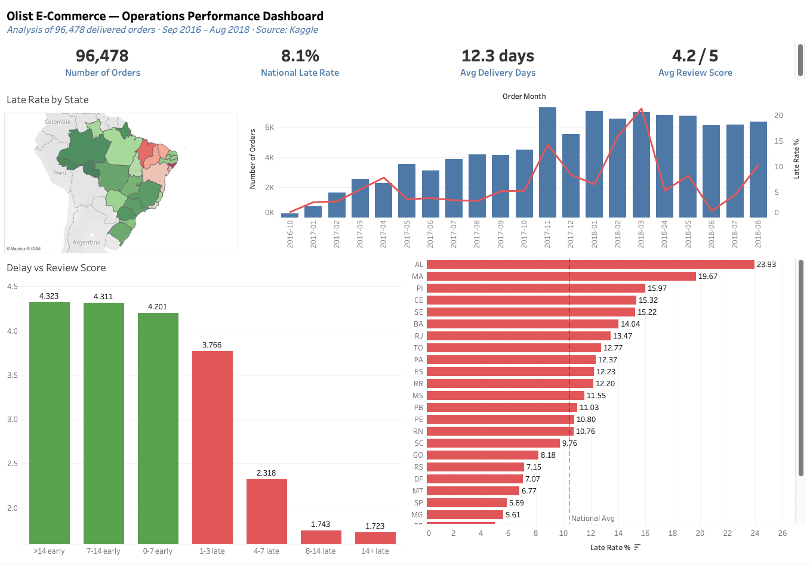

# Olist E-Commerce — Operations Performance Analysis

## Overview
End-to-end operations analysis of 100,000+ Brazilian e-commerce orders 
to identify fulfillment bottlenecks, delivery failures, and their impact 
on customer satisfaction.

**Tools:** Python (pandas) · BigQuery SQL · Tableau  
**Dataset:** [Olist Brazilian E-Commerce Dataset — Kaggle](https://www.kaggle.com/datasets/olistbr/brazilian-ecommerce)  
**Dashboard:** [View on Tableau Public](https://public.tableau.com/views/OlistE-CommerceOperationsPerformance/OperationsReview?:language=en-US&publish=yes&:sid=&:redirect=auth&:display_count=n&:origin=viz_share_link)


## Dashboard Preview



## Pipeline Architecture
```
Raw CSVs (9 files)
    ↓
Python / pandas (on jupyter notebook) — data cleaning & feature engineering
    ↓
BigQuery SQL — operational KPI analysis
    ↓
Tableau — interactive operations dashboard
```

## Key Findings

**1. Northeast states have late delivery rates 2–3x the national average**  
Alagoas (AL) has the highest late rate at 23.9% and Maranhão (MA) at 19.7%, 
compared to the national average of 10.4%. São Paulo (SP), despite handling 
40,500+ orders, maintains a 5.9% late rate — suggesting infrastructure 
density is the primary driver of delivery performance.

**2. Late delivery causes severe and immediate customer satisfaction damage**  
Orders arriving on time average 4.2 stars. Orders arriving 4–7 days late 
drop to 2.3 stars — a 45% reduction. Beyond 8 days late, scores plateau 
at 1.7 regardless of additional delay, suggesting customers have already 
decided to leave a negative review by day 8.

**3. Two distinct operational crises identified in the data**  
November 2017 (Black Friday): late rate spiked from 5.3% to 14.3% as 
order volume surged 63% month-over-month — the logistics network could 
not absorb the demand spike. February–March 2018: late rate reached 21.4% 
despite stable order volumes, suggesting a carrier or warehouse operational 
failure unrelated to demand.


## Recommendations

**1. Prioritise carrier capacity in Northeast states**  
AL, MA, PI, CE, and SE collectively account for a disproportionate share 
of late deliveries. Partnering with regional last-mile carriers or 
establishing regional fulfillment hubs in the Northeast would reduce 
late rates in these states.

**2. Implement a Black Friday surge protocol**  
The November 2017 crisis was predictable. Olist should pre-negotiate 
carrier capacity 60 days before peak periods and set seller dispatch 
SLAs to 24 hours during surge months to absorb volume spikes without 
late rate deterioration.


## Detailed Analysis

### Q1. On-Time Delivery by State

- National late delivery rate: 8%
- Worst state: Alagoas (AL) at 23.9% — 3x the national average
- Northeast cluster (AL, MA, PI, CE, SE, BA) all above 14% late rate
- Highest absolute late orders: Rio de Janeiro (RJ) with 1,664 late orders
- São Paulo (SP) best among high-volume states at 5.9% despite 40,501 orders
- Amazon region (AM) has longest avg delivery at 25.6 days but low late rate —
  suggests Olist inflates delivery estimates for remote areas

### Q2. Seller Processing Time by State

- Processing times are consistent across all states (0.3–0.7 days avg)
- Seller processing is NOT the primary bottleneck — delays occur downstream
  in shipping and last-mile delivery
- Single seller in MA handles 388 orders with 23.2% late rate —
  highest late rate among high-volume seller states
- SP dominates seller volume: 1,764 sellers handling 68,376 orders at 8.8% late rate
- Review scores consistent (4.0–4.5) across all states regardless of processing
  speed — confirms processing time alone doesn't drive customer satisfaction

### Q3. Delivery Delay vs Review Score

- On-time/early orders score consistently between 4.2 and 4.32
- Early delivery beyond 7 days adds almost no satisfaction benefit (4.31 vs 4.32)
- Review scores collapse the moment an order is late:

| Delay Band | Avg Review Score | Change from On-Time |
|---|---|---|
| 0–7 days early | 4.20 | baseline |
| 1–3 days late | 3.77 | -0.43 |
| 4–7 days late | 2.32 | -1.88 |
| 8–14 days late | 1.74 | -2.46 |
| 14+ days late | 1.71 | -2.49 |

- Score plateaus below 1.75 beyond 8 days late — damage is done by day 8
- 5,025 orders are 4+ days late — actively damaging marketplace reputation
- **Operational implication:** preventing any lateness is far more valuable
  than reducing how late an order is once already delayed

### Q4. Category Performance

- Audio has the highest late rate at 12.7% with low review score (3.84)
- Office furniture has longest avg delivery at 19.9 days — nearly double
  most categories — driving its 3.51 review score (lowest in dataset)
- High volume problem categories:

| Category | Orders | Late Rate | Est. Late Orders |
|---|---|---|---|
| health_beauty | 8,647 | 9.1% | ~787 |
| bed_bath_table | 9,272 | 8.4% | ~779 |
| electronics | 2,517 | 9.7% | ~244 |

- Heavy/bulky categories consistently show longer delivery times —
  suggests carrier capacity issues for large items
- Food performs well operationally (8.7 avg delivery days) despite
  being perishable — likely prioritised by carriers

### Q5. Monthly Order Volume and Delivery Trend

- Olist grew from 265 orders (Oct 2016) to 7,000+/month by 2018 — 25x in 18 months
- Three distinct operational stress events identified:

**Event 1 — Black Friday Nov 2017**
Orders spike 63% MoM to 7,289. Late rate jumps from 5.3% to 14.3%.
Review score drops to 3.99. Logistics network unable to absorb demand surge.

**Event 2 — Feb–Mar 2018 Crisis (most severe)**
Late rate hits 16.0% in Feb and 21.4% in Mar — dataset peak.
Avg delivery days reach 16.4 in Feb. Review score drops to 3.81.
NOT demand-driven — order volumes stable. Likely carrier or warehouse failure.

**Event 3 — Aug 2018 Artifact**
10.4% late rate despite fastest avg delivery (7.7 days).
Likely data artifact — orders not yet delivered when dataset was compiled.

- Outside crisis periods late rate stabilises at 3–6% — baseline ops are manageable
- Delivery times improved: 19 days avg (Oct 2016) → 8.9 days (Jul 2018)
  as network matured


## Repository Structure
```
olist-ops-analysis/
├── notebooks/
│   └── 01_data_exploration_and_cleaning.ipynb
├── sql/
│   ├── q1_ontime_by_state.sql
│   ├── q2_seller_processing.sql
│   ├── q3_delay_vs_review.sql
│   ├── q4_category_performance.sql
│   └── q5_monthly_trend.sql
├── docs/
│   └── screenshots/
└── README.md
```


## How to Reproduce
1. Download dataset from [Kaggle](https://www.kaggle.com/datasets/olistbr/brazilian-ecommerce) → place CSVs in `data/raw/`
2. Run `notebooks/01_data_exploration_and_cleaning.ipynb` to generate clean files
3. Load the following into BigQuery as separate tables:
   - `data/clean/olist_master.csv` → `orders_master`
   - `data/clean/olist_sellers.csv` → `sellers`
   - `data/clean/olist_products.csv` → `products`
   - `data/clean/olist_order_items.csv` → `order_items`
4. Run queries in `sql/` folder against the BigQuery tables
5. Connect Tableau Public to `data/clean/olist_master.csv` to reproduce the dashboard

